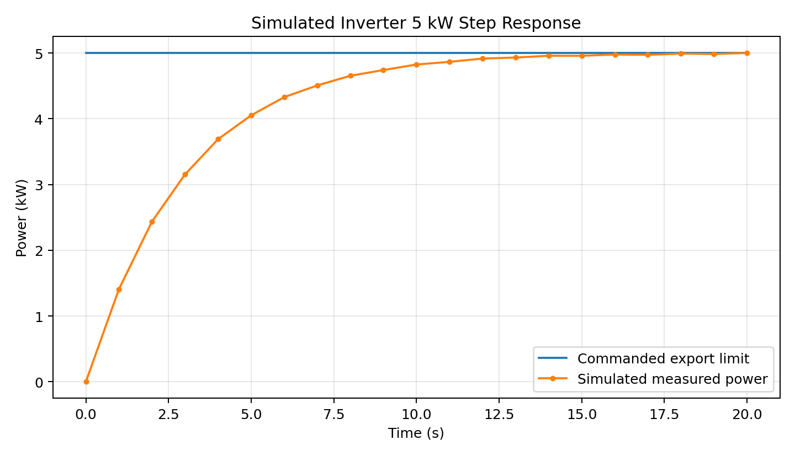

# DER Device Test Platform v2 (C++17)

A compact C++17 portfolio project that models and automatically tests simulated distributed energy resource (DER) equipment: an inverter, battery and EV charger.

Version 2 improves the original project by adding **time-domain device behaviour** instead of making outputs jump instantly to a commanded value. The simulator now uses first-order dynamic response models, battery energy/efficiency calculations, deterministic measurement error, fault/reset logic and generated step-response data.

> **Important:** This is an educational simulator. It does **not** claim certification, CSIP-AUS conformance, IEEE 2030.5 conformance, OCPP conformance, Modbus protocol compliance, or AS/NZS 4777 compliance. The register map, protection thresholds and device models are simplified demonstration values only.

## What it demonstrates

- C++17 classes, inheritance and polymorphic device interfaces
- Separation of shared DER behaviour from device-specific behaviour
- Time-step simulation
- First-order dynamic response models
- `P = VI` and `E = Pt` engineering calculations
- Battery charge/discharge efficiency
- Command validation against equipment ratings
- Fault injection, fault reset and communications-loss testing
- Modbus-style integer register maps
- Automated tolerance-based PASS/FAIL tests
- CSV test reporting
- Inverter step-response data generation for later plotting/analysis
- CMake and direct `g++` build workflows

## Main modelling ideas

### Inverter

The inverter does not jump directly to the requested export power. It follows a first-order model:

```text
dP/dt = (P_command - P) / tau
```

The discrete update used in the code is:

```text
alpha = 1 - exp(-dt/tau)
P_next = P + alpha * (P_command - P)
```

A small deterministic measurement error is added so automated tests remain repeatable while still representing non-ideal telemetry.

### Battery

Battery state of charge uses:

```text
Energy = Power * Time
```

with separate charge and discharge efficiencies. Positive power means discharge; negative power means charging.

### EV charger

Charging current approaches the requested current limit with a first-order dynamic model. Charging power is then calculated using:

```text
P = V * I
```

## Automated tests

The program currently runs 14 tests covering:

1. Inverter first-order transient response.
2. Settled inverter export-limit tracking.
3. Rejection of an inverter command above its rating.
4. Demonstration over-voltage shutdown.
5. Fault-reset blocking and recovery.
6. Telemetry publication to a Modbus-style register map.
7. Communications-loss command rejection.
8. Battery discharge energy/SOC calculation with efficiency.
9. Battery charging energy/SOC calculation with efficiency.
10. Rejection of battery power above rating.
11. Low-SOC discharge protection.
12. EV charger current-ramp transient.
13. Settled EV current-limit tracking.
14. Rejection of EV current above rating.

## Build with g++

### Windows / MinGW

```bash
g++ -std=c++17 -Wall -Wextra -Wpedantic -Iinclude src/main.cpp src/DerDevice.cpp src/RegisterMap.cpp src/Inverter.cpp src/Battery.cpp src/EVCharger.cpp src/TestFramework.cpp src/CsvReporter.cpp -o der_test_platform_v2.exe

.\der_test_platform_v2.exe
```

### Linux / macOS / WSL

```bash
g++ -std=c++17 -Wall -Wextra -Wpedantic -Iinclude src/main.cpp src/DerDevice.cpp src/RegisterMap.cpp src/Inverter.cpp src/Battery.cpp src/EVCharger.cpp src/TestFramework.cpp src/CsvReporter.cpp -o der_test_platform_v2

./der_test_platform_v2
```

## Build with CMake

```bash
cmake -S . -B build
cmake --build build
```

## Generated outputs

Running the program creates:

```text
reports/test_results.csv
reports/inverter_step_response.csv
```

The second file contains time-series data showing the inverter output moving toward a 5 kW command. It can be opened in Excel, MATLAB or Python and plotted as a step response.

A ready-made plot is included at `docs/inverter_step_response.png`:



## Project structure

```text
ZECO_DER_Test_Platform_v2/
├── CMakeLists.txt
├── README.md
├── include/
│   ├── Battery.h
│   ├── CsvReporter.h
│   ├── DerDevice.h
│   ├── EVCharger.h
│   ├── Inverter.h
│   ├── RegisterMap.h
│   └── TestFramework.h
├── src/
│   ├── Battery.cpp
│   ├── CsvReporter.cpp
│   ├── DerDevice.cpp
│   ├── EVCharger.cpp
│   ├── Inverter.cpp
│   ├── RegisterMap.cpp
│   ├── TestFramework.cpp
│   └── main.cpp
├── docs/
│   └── ARCHITECTURE.md
└── reports/
```

## Interview explanation

> “I built a C++ automated test platform for simulated DER devices. The second version moves beyond fixed outputs by using time-step dynamic models: the inverter and EV charger follow first-order responses, while the battery updates state of charge from power, elapsed time and efficiency. I then inject abnormal conditions such as over-voltage and communications loss and automatically compare actual behaviour with expected behaviour. Results are written to CSV, including an inverter step response that can be analysed separately.”

## Honest scope

This project demonstrates testing architecture and simplified engineering modelling. It deliberately does not claim to implement a real field protocol or regulatory compliance test suite. A future hardware-backed version could replace the simulated register map with a real Modbus client or serial/TCP device while preserving the same test framework.
